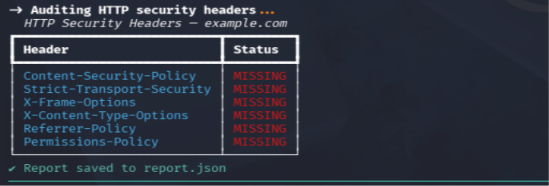
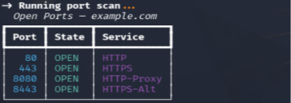
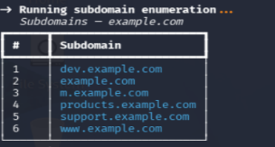

# Recon CLI

**Open-source Penetration Testing & Reconnaissance CLI Tool**

Fast, asynchronous, terminal-based reconnaissance toolkit for subdomain enumeration, port scanning, and HTTP security header auditing — built for security researchers, CTF players, and pentesters.


---

## Features

- **Subdomain Enumeration** — Passive recon via Certificate Transparency logs (crt.sh), with duplicate and false-positive filtering.
- **Async Port Scanner** — High-speed asynchronous TCP scanning of the most commonly targeted ports, with configurable concurrency and timeout.
- **HTTP Security Header Audit** — Checks for the presence of critical security headers (CSP, HSTS, X-Frame-Options, and more).
- **Rich Terminal Output** — Color-coded, readable tables via the `rich` library.
- **JSON Export** — Save full scan results to a structured JSON report for later analysis.

---

## Screenshots

> _Add your own terminal screenshots here after running a scan, e.g.:_

```



```

---

## Installation

```bash
git clone https://github.com/<your-username>/recon-cli.git
cd recon-cli
python3 -m venv venv
source venv/bin/activate
pip install -r requirements.txt
```

---

## Usage

```bash
python3 main.py <target> [OPTIONS]
```

### Options

| Flag | Description |
|------|-------------|
| `--subdomains` | Enumerate subdomains via crt.sh Certificate Transparency logs |
| `--ports` | Run an asynchronous TCP port scan against the target |
| `--headers` | Audit the target's HTTP response for security headers |
| `--all` | Run all three modules in sequence |
| `--output FILE` | Save full results to a JSON file (e.g. `report.json`) |
| `--timeout SECONDS` | Timeout for each port scan connection (default: `1.5`) |
| `--concurrency N` | Max concurrent port scan connections (default: `100`) |

### Examples

**Run everything and save a report:**
```bash
python3 main.py example.com --all --output report.json
```
Runs subdomain enumeration, port scan, and header audit together, then writes the combined results to `report.json`.

**Enumerate subdomains only:**
```bash
python3 main.py example.com --subdomains
```
Queries crt.sh for certificates issued to `*.example.com` and lists every unique, valid subdomain found.

**Scan ports with custom timing:**
```bash
python3 main.py example.com --ports --timeout 2 --concurrency 200
```
Scans common ports (21, 22, 80, 443, 8080, etc.) with a 2-second timeout per connection and up to 200 concurrent checks — useful for slower or rate-limited targets.

**Audit HTTP security headers only:**
```bash
python3 main.py example.com --headers
```
Sends a GET request to the target and reports which security headers (CSP, HSTS, X-Frame-Options, etc.) are `PRESENT` or `MISSING`.

---

## Project Structure

```
recon-cli/
├── main.py                 # CLI entry point (argparse + rich)
├── requirements.txt
├── modules/
│   ├── subdomain.py         # crt.sh-based subdomain enumeration
│   ├── port_scanner.py      # asyncio TCP port scanner
│   └── http_audit.py        # HTTP security header audit
└── utils/
    └── reporter.py          # rich tables + JSON export
```

---

## Disclaimer

This tool is intended for use only against systems you own or have **explicit authorization** to test. Unauthorized scanning of third-party systems may be illegal in your jurisdiction. The author assumes no liability for misuse.

---

## License

This project is licensed under the [MIT License](LICENSE).

---

## Contributing

Pull requests are welcome. For major changes, please open an issue first to discuss what you'd like to change.
